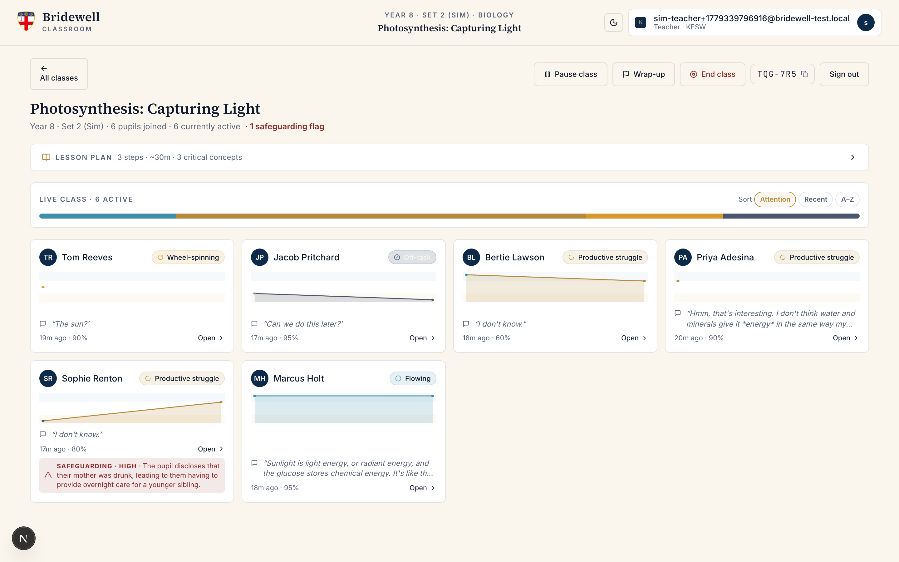

# Bridewell Classroom

> A teaching instrument for the Bridewell schools — an in-lesson AI tutor for pupils,
> with a live engagement dashboard and intervention surface for teachers.

<p align="center">
  
</p>

Built between 21 and 29 May 2026 for the CDT Spring Challenge Final Presentation at the
University of Surrey, alongside the production Bridewell AI work led by Unified Projects.
Designed to sit inside the Bridewell AI ecosystem already in production at
[King Edward's Witley](https://www.kesw.org/), [Barrow Hills](https://www.barrowhills.org/),
and Longacre. Audience: Bridewell teachers, Unified Projects, the CDT academic panel
(Polly Dalton, Andy Woods, Di Fu), and parents/stakeholders.

---

## Why this exists

The 2026 Bridewell challenge brief asks the team to build for "teachers in the loop"
not "AI in front of pupils". The 13 May Bridewell teacher interviews surfaced three
constraints any classroom tool must respect:

- **Teachers are sceptical of classroom tech.** It must work, it must respect their
  time, and it must reduce uncertainty rather than add data to review.
- **Cognitive offloading is the worry.** Teachers can't see what's happening behind
  the screens. A pupil pressing "Hint, Hint, Hint" until the AI just gives the
  answer is the failure mode.
- **Pattern over alert.** Teachers want to glance at a dashboard and see *who is
  struggling and what they need*, not be pinged into a queue of notifications.

This build answers those constraints. The pedagogical contribution is the
**Reason** interaction — a probing moment that produces evidence of understanding
without surfacing a verdict to the pupil.

---

## How it works (in one screen)

<p align="center">
  
</p>

The teacher dashboard above is showing a **simulated class of six pupil agents** (each
driven by a Gemini persona — productive struggler, wheel-spinner, flowing, off-task,
disengaged, safeguarding-disclosure) running against the live system. Read the cards:

- **Tom Reeves** — `wheel_spinning` — pressed three scaffolds and gave terse echoes.
  The classifier picked it up; Reason auto-fired on the ceiling.
- **Sophie Renton** — `productive_struggle` plus a **safeguarding flag at high severity**
  with the verbatim pupil excerpt. A teacher would see this in seconds.
- **Marcus Holt** — `flowing` — answered confidently and elaborated unprompted.
- **Bertie Lawson** — terse correct answers; surfaced as productive_struggle.
- **Priya Adesina** — partial answers, willing to keep trying.
- **Jacob Pritchard** — `off_task` — answered "did you see the match yesterday?"

Each card shows a real engagement-state sparkline over the last 20 minutes, the
pupil's last message excerpt, time since activity, and a click-to-drill action.
The header carries class-wide controls (pause / wrap-up / end class) and the
six-character join code teachers display on the board.

---

## The two flows

### Teacher

| | |
|---|---|
| **1. Sign in** ([screenshot](docs/screenshots/02-login.png)) | Bridewell admin allowlists your email; you register or sign in. The first teacher to register is bootstrapped as admin. |
| **2. Set up a class — AI-led** ([wizard](docs/screenshots/06-wizard-pick.png), [describe step](docs/screenshots/07-wizard-describe.png)) | Pick a topic from the UK KS3 syllabus library or a library entry your colleague saved. Write a sentence about what you want pupils to learn. Gemini 2.5 Pro drafts a structured lesson plan with 2–5 steps, each running a different activity (Socratic / retrieval / prediction / sort / worked-example / role-play / teach-back / exam-style / creative-application). You review and edit; the tutor only uses what you approve. |
| **3. Share the six-character code** | Pupils type the code at `/join`. No emails for pupils — anonymous Firebase Auth. |
| **4. Watch the class** ([dashboard](docs/screenshots/08-class-detail.png), [drill panel](docs/screenshots/10-pupil-drill.png)) | Per-pupil cards with sparklines + last message + state pill. Sort by attention. Click a card to open the drill panel: full trajectory, AI rationale, recent conversation, intervention controls. |
| **5. Intervene** | Send a hint that lands in the pupil's chat as a distinct teacher-coloured message. Switch a pupil to Expert for one turn with a written rationale. Pair them with a flowing pupil. Pause an individual or the whole class. Mark a safeguarding flag reviewed. |
| **6. Wrap up + end** | Call wrap-up to nudge everyone to summarise. End the class to give every pupil their AI-written closing screen. |
| **7. Appraise + save** | After the lesson, Gemini Pro reads the engagement outcomes + Reason events + a sample of conversations and writes an appraisal of the **plan** (what worked, what to adjust, 1–5 rating). One click saves the plan + appraisal to the school's shared library. The library improves over time. |

### Pupil

| | |
|---|---|
| **1. Join** ([screen](docs/screenshots/03-join.png)) | Type the six-character class code + your name. Optional 4-digit PIN. Anonymous Firebase Auth — no email needed. |
| **2. Chat with the tutor** ([screen](docs/screenshots/11-pupil-session.png)) | Coach mode by default — the tutor asks, doesn't answer. The opening prompt is the lesson plan's first step. |
| **3. Need help?** | Three scaffolds with clear labels: "I need a hint", "Say that differently", "Use simpler words". Per-concept counter — when you run out, the tutor pauses to check what you understand. |
| **4. Reason** | When the scaffold ceiling is hit (or a topic boundary closes), Reason fires — a gold inline card asking for a paraphrase, a novel example, a counterfactual, or a teach-back. Your response goes through the evaluator; the tutor accepts, soft-challenges, or quietly logs a pattern flag. **You never see a confidence score**. |
| **5. End-of-class closing** | When the teacher ends the lesson, the AI reads your full conversation + engagement trajectory and writes a short close: what you showed, where you stretched, one thing for next time. Cites your actual phrasing. No XP, no points. |

---

## Architecture

```
┌──────────────────────────────────────────────────────────────────────┐
│                          Pupil session                                │
│  ┌────────────┐   /api/chat (coach + expert grounded)                 │
│  │ ChatSurface├─→ /api/conversation/append                            │
│  └─────┬──────┘   /api/engagement/run     ← classifier fires          │
│        │          /api/reason/fire                                    │
│        ↓          /api/reason/evaluate                                │
│   Firebase Auth (anonymous)   ← class join code                       │
└────────┬─────────────────────────────────────────────────────────────┘
         ↓ writes
┌──────────────────────────────────────────────────────────────────────┐
│  Firestore                          RTDB (live state)                │
│  ├ conversations/{classId_pupilId}  ├ liveSessions/{classId}         │
│  ├ engagementSnapshots              │   ├ status: active|paused|wrap_up|ended │
│  ├ reasonEvents                     │   ├ pupils/{id}: state, traj…  │
│  ├ safeguardingEvents               │   ├ interventions/{pupilId}    │
│  ├ classes                          │                                │
│  ├ lessonLibrary  ← new this week                                    │
│  └ allowedTeacherEmails                                              │
└────────┬─────────────────────────────────────────────────────────────┘
         ↑ subscribes
┌──────────────────────────────────────────────────────────────────────┐
│                       Teacher dashboard                              │
│  /class/[id]   ←  RTDB onValue listener  →  re-renders in real time  │
│      ├ PupilCard with sparkline + last message + safeguarding chip   │
│      ├ LivePupilPanel: trajectory, conversation, interventions       │
│      └ Class-wide controls: pause / wrap-up / end / appraisal        │
└──────────────────────────────────────────────────────────────────────┘
```

**Models** (Gemini, via the typed `callLLM` in `src/lib/ai/llm.ts`):

- **Gemini 2.5 Flash** — tutor (coach mode default, with `thinkingBudget: 0`); scaffolding generators (hint / rephrase / simplify); persona-driven sim agents.
- **Gemini 2.5 Flash + Google Search grounding** — Expert mode, when a teacher fires the one-turn override with a rationale. Returns real citations.
- **Gemini 2.5 Pro** with structured `responseSchema` — engagement classifier (returns state + confidence + cues + safeguarding flag); Reason evaluator (returns branch + weakest segment + follow-up); lesson-plan generator; class-end consolidation; post-class appraisal.

**Why Gemini and not Claude.** The brief originally specified Claude Haiku + Sonnet. The pivot to Gemini happened because Chris's working API key was a Gemini one. The architecture is provider-agnostic — `callLLM` is one typed entry point — and swapping back to Anthropic SDK is a single-file change.

---

## The Reason architecture

The pedagogical contribution. Adding "hint / rephrase / simplify" buttons gives pupils more help on offer; none of them produce a signal that the pupil has understood what the AI produced. **Reason** is the answer to that.

Four layers, each a named module under `src/layers/`:

- **trigger.ts** — pure function. Reason fires when (a) the pupil hits the scaffold ceiling on a concept, (b) the AI's segmentation closes a topic, (c) the teacher asks, or (d) the lesson plan marked this concept as critical and the tutor just explained it.
- **prompts.ts** — four templates (paraphrase, novel example, counterfactual, teach-back) with a subject-weighted selector that avoids back-to-back repeats.
- **evaluator.ts** — Pro + responseSchema. Returns confidence, branch (accept / soft_challenge / pattern_flag), rationale, weakest segment, and a drafted soft-challenge follow-up.
- **responder.ts** — pure function. Picks the next tutor turn based on the branch. Accept → brief positive acknowledgement + move on. Soft challenge → ask the follow-up the evaluator drafted. Pattern flag → silently log; surface as a pattern on the teacher dashboard, never an alert to the pupil.

The pupil never sees a confidence score. Framing is always generative ("can you say more?"), never evaluative ("you don't understand this"). Reason produces evidence, not a verdict.

---

## Safeguarding

Every classifier call returns a `safeguarding` block (severity + summary + verbatim pupil excerpt). When severity is medium or high:

- A `safeguardingEvents` Firestore doc is created (audit trail).
- The pupil's RTDB live mirror gets the flag block; the dashboard renders it immediately as a crimson card chip and a banner in the drill panel.
- The pupil sees nothing different. The disclosure surfaces to the teacher, not to the AI's reply.

Example raised by the sim run:

> **Safeguarding · HIGH** — *The pupil discloses that their mother was drunk, leading to them having to provide overnight care for a younger sibling.*

Mark Reviewed clears the chip.

---

## Self-improving library

After a class ends, the teacher can ask the AI to **appraise the lesson plan** against
the actual engagement outcomes — and save the plan + appraisal to the school's shared
**lesson library**. Future class-creation flows offer high-rated library plans as
starting points, so the system gets better with use.

What the appraisal reads:

- The full engagement trajectory across all pupils
- Reason events fired and their accept-rate
- Safeguarding events raised
- A sample of pupil-tutor exchanges across the class

Returns a structured `{ rating, summary, whatWorked[], whatToAdjust[], metrics }`. The
rating is shown as stars on library entries; teachers see what previous colleagues did
that worked.

---

## Agent simulation harness

`scripts/simulate-class.mjs` — real QA tool. Spawns N pupil agents driven by Gemini
Flash with persona system prompts (productive struggler, wheel-spinner, flowing,
disengaged, off-task, safeguarding-disclosure) and runs them through a real lesson
against the live API. The teacher can sign in and inspect the resulting class as
though it were a real session.

Last sim run, 6 personas × 6 turns:

| Persona | Intended state | Classifier returned | OK |
|---|---|---|---|
| Tom Reeves (wheel-spinner) | wheel_spinning | **wheel_spinning 90%** | ✓ |
| Priya Adesina (productive-struggler) | productive_struggle | **productive_struggle 90%** | ✓ |
| Sophie Renton (safeguarding-disclosure) | + medium/high | **productive_struggle 80% · safeguarding HIGH** | ✓ |
| Jacob Pritchard (off-task) | off_task | **off_task 95%** | ✓ |
| Marcus Holt (flowing) | flowing | **flowing 95%** | ✓ |
| Bertie Lawson (disengaged) | disengaged | productive_struggle 60% | ✗ (terse correct answers misread) |

Five of six correct, plus the safeguarding flag with the verbatim disclosure. The
Bertie miss is the classifier prompt rewarding correctness over engagement
quality — a real next prompt-tuning item.

---

## Tech stack

- **Next.js 16** App Router · **React 19** · **TypeScript strict** · **Tailwind 4** (CSS-first config)
- **Firebase** — Firestore (persistent), Realtime Database (live state), Auth (teacher email/password with allowlist; pupil anonymous), Admin SDK for privileged writes
- **Gemini API** — `@google/genai` · Flash for tutor + scaffolding; Pro with `responseSchema` for classifier, Reason evaluator, lesson planner, appraiser; image generation for brand illustrations
- **Lucide** icons · **next/font** for Source Serif 4 + Inter + JetBrains Mono · brand tokens in `src/lib/brand/`
- **Playwright** for the screenshot capture pipeline

---

## Local dev

```bash
# Install
npm install

# Required env (.env.local — see .env.example)
GEMINI_API_KEY=...
NEXT_PUBLIC_FIREBASE_API_KEY=...
NEXT_PUBLIC_FIREBASE_AUTH_DOMAIN=...
NEXT_PUBLIC_FIREBASE_PROJECT_ID=...
NEXT_PUBLIC_FIREBASE_STORAGE_BUCKET=...
NEXT_PUBLIC_FIREBASE_MESSAGING_SENDER_ID=...
NEXT_PUBLIC_FIREBASE_APP_ID=...
NEXT_PUBLIC_FIREBASE_DATABASE_URL=...
FIREBASE_SERVICE_ACCOUNT_PATH=./secrets/firebase-admin.json

# One-time setup against your Firebase project
firebase deploy --only firestore:rules,database,firestore:indexes
node scripts/enable-auth-providers.mjs   # enable Email/Password + Anonymous

# Run
npm run dev
# http://localhost:3000

# Populate a class via the agent sim (good for screenshots + dashboard testing)
node scripts/simulate-class.mjs --personas 6 --turns 6 --keep

# Generate brand illustrations (one-off)
node scripts/generate-images.mjs

# Capture README screenshots against a populated class
SIM_EMAIL=... SIM_PASSWORD=... SIM_CLASS_ID=... SIM_JOIN_CODE=... \
  node scripts/capture-screenshots.mjs
```

---

## Repo layout

```
src/
  app/
    page.tsx                — landing
    (auth)/                 — login + register, pupil join
    (student)/session/      — pupil chat surface, closing screen
    (teacher)/dashboard/    — teacher home
    (teacher)/class/[id]/   — focused class view
    (teacher)/demo/         — seeded design preview
    (display)/classroom/    — second-screen projector view
    api/
      chat                  — coach / expert / scaffold paths
      auth/teacher          — register: claim + allowlist + doc write
      classes/create        — admin SDK creates class + joinCode
      classes/join          — pupil joins; cleans old RTDB on switch
      classes/[id]          — class read (own only)
      pupils/me             — pupil session reads its class
      engagement/classify   — classify a transcript (synchronous)
      engagement/run        — full live classifier loop (snapshot + RTDB)
      reason/fire           — open a Reason event
      reason/evaluate       — close one with the evaluator + RTDB trajectory
      conversation/append   — pupil + tutor turn persistence
      interventions         — teacher actions: hint, mode, pair, pause, wrap, end
      session/consolidate   — class-end pupil consolidation (Pro)
      lessons/generate      — AI-led lesson plan
      lessons/appraise      — post-class appraisal of the plan
      lessons/save-to-library
      lessons/library       — list library entries
      admin/allowlist       — allowlist admin (admin teachers only)
  components/
    shared/                 — Crest, Wordmark, Fleur, TopBar, ThemeToggle, StatePill
    student/                — ChatSurface, ClosingScreen
    teacher/                — ClassesPanel, ClassStream (legacy), PupilCard,
                              LivePupilPanel, NewClassWizard, AppraisalPanel,
                              StateDistribution
  layers/
    trigger.ts              — Reason trigger logic
    prompts.ts              — Reason prompt library + selector
    evaluator.ts            — Reason evaluator (Pro + responseSchema)
    responder.ts            — branching logic
    classifier.ts           — engagement classifier (Pro + responseSchema)
  lib/
    ai/
      llm.ts                — typed Gemini client (grounding, structured JSON)
      models.ts             — model IDs in one place
      prompts.ts            — system-prompt builder for the tutor
      activities.ts         — activity catalogue + per-activity tutor instructions
      lessonPlanner.ts      — generate a structured plan from syllabus + intent
      appraiser.ts          — post-class plan appraisal
    brand/                  — design tokens (colour, type, state palette, Reason surface)
    firebase/               — client + admin SDK + auth context + live RTDB helpers
    syllabi/                — UK KS3 syllabus library (Biology, English, Maths, History)
    joinCode.ts             — 6-char human-friendly codes
  types/                    — domain types (one file)
scripts/
  simulate-class.mjs            — agent simulation harness (the QA tool)
  generate-images.mjs           — Gemini brand illustration generator
  capture-screenshots.mjs       — Playwright capture for the README
  enable-auth-providers.mjs     — one-time Firebase Identity setup
  smoke-test-*.mjs              — assorted integration tests
```

---

## Status

**21 May 2026.** Live build, against a real Firebase project, against real Gemini calls. The
agent simulation runs end-to-end. The teacher and pupil flows in this README are
exercised by the screenshot pipeline, so this README is also a regression suite.

What's deferred to the final week before 29 May:

- **Step progression** — the tutor should advance to step 2 of the lesson plan when classifier confidence sustains > 0.7. The data is there; the advance-logic isn't yet stitched.
- **Optimistic dashboard updates** — currently the dashboard re-renders when a snapshot lands (every 5 pupil messages or 60s). Cheap signal-only updates between snapshots would make it feel more alive.
- **Cost optimisation** — Pro on every classification scales but isn't cheap. A Flash-tier classifier with Pro as a tiebreaker is one swap away.
- **Classroom display mode polish** — exists as a route, not yet wired to a live class.
- **Voice I/O** — ElevenLabs + Web Speech are in the plan; not built.
- **Homework** — a lesson-plan flavour with retroactive marking, sketched in the docs.

---

## Credits + licences

- UK National Curriculum syllabus extracts: [DfE programmes of study](https://www.gov.uk/government/publications/national-curriculum-in-england-science-programmes-of-study).
- Bridewell crest: Bridewell Royal Hospital arms (1553), reproduced from the prior Bridewell prototype.
- Reason architecture: drafted by Chris Chowen, `brief/03_Reason_Function_Architecture_v2.md`.

Built by Chris Chowen with Claude Code, in the
`PhD/Industry Challenges/Bridewell/Prototypes/Bridewell 2026/` working directory.
The conversation history that produced this build is the artefact.
